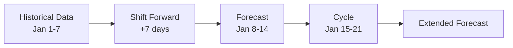

# Historical Shift Forecaster

The Historical Shift forecaster is HAFO's primary algorithm for generating forecasts from entity history.

## How It Works

The algorithm is straightforward:

1. **Fetch History**: Retrieve the last N days of hourly statistics from the recorder
2. **Shift Forward**: Add N days to each timestamp to project into the future
3. **Cycle Pattern**: Repeat the pattern to fill the entire forecast horizon



## Example

With `history_days: 7`:

| Historical Time    | Forecast Time      | Value  |
| ------------------ | ------------------ | ------ |
| Jan 1, 10:00 (Mon) | Jan 8, 10:00 (Mon) | 2.5 kW |
| Jan 1, 11:00 (Mon) | Jan 8, 11:00 (Mon) | 3.1 kW |
| Jan 2, 10:00 (Tue) | Jan 9, 10:00 (Tue) | 2.8 kW |
| ...                | ...                | ...    |

The pattern repeats: Jan 15 uses Jan 8's forecast (which came from Jan 1), and so on.

## When to Use

The Historical Shift forecaster works best for:

- ✅ **Regular patterns**: Daily/weekly cycles (home power usage, temperature)
- ✅ **Stable loads**: Consistent consumption patterns
- ✅ **Short-term forecasting**: 1-14 day horizons

It may not be ideal for:

- ❌ **Highly variable data**: Random or unpredictable values
- ❌ **Trend-following**: Data with strong upward/downward trends
- ❌ **Weather-dependent**: Values that correlate with weather (use dedicated integrations)

## Configuration

### History Days

The `history_days` parameter determines both:

1. How much history to fetch
2. How far to shift it forward

| Value | Pattern Captured | Use Case                       |
| ----- | ---------------- | ------------------------------ |
| 1     | Daily cycle only | Very recent patterns           |
| 7     | Weekly cycle     | Weekday vs weekend differences |
| 14    | Two-week cycle   | Smoothing anomalies            |
| 30    | Monthly cycle    | Long-term averaging            |

!!! tip "Recommended: 7 days"

    For most home energy use cases, 7 days captures the weekly pattern effectively.
    Weekday usage differs from weekends, and this is captured with a 7-day window.

## Forecast Attributes

The sensor provides these attributes:

| Attribute              | Description                                     |
| ---------------------- | ----------------------------------------------- |
| `source_entity`        | The entity being forecast                       |
| `history_days`         | Number of days of history used                  |
| `last_forecast_update` | When the forecast was last generated            |
| `forecast`             | List of forecast points with datetime and value |

### Forecast Format

The `forecast` attribute contains a list of points:

```yaml
forecast:
  - datetime: '2025-01-15T10:00:00+00:00'
    native_value: 2.5
  - datetime: '2025-01-15T11:00:00+00:00'
    native_value: 3.1
  - datetime: '2025-01-15T12:00:00+00:00'
    native_value: 2.8
```

This format is compatible with other Home Assistant integrations that consume forecast data.

## Limitations

1. **Hourly Resolution**: Statistics are hourly; finer resolution is not available
2. **Mean Values**: Uses the hourly mean, not min/max/sum
3. **History Required**: Needs at least `history_days` of data in the recorder
4. **No Interpolation**: Values are shifted as-is without smoothing
